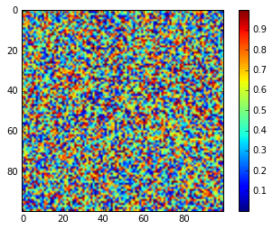
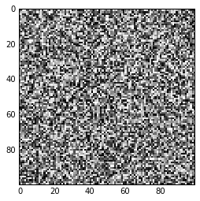
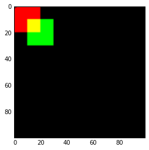
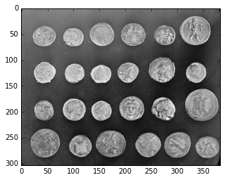
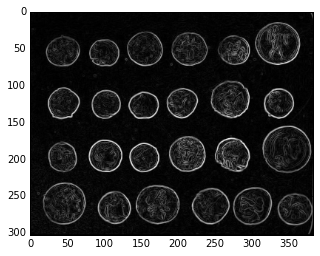

# Images

~~~
%matplotlib inline
from matplotlib import pyplot as plt
import numpy as np
~~~
{: .python}

~~~
image = np.random.random((100, 100))
~~~
{: .python}

~~~
plt.imshow(image)
plt.colorbar()
~~~
{: .python}

<matplotlib.colorbar.Colorbar at 0x107efe990>

~~~
plt.imshow(image, cmap='gray', interpolation='nearest')
~~~
{: .python}

<matplotlib.image.AxesImage at 0x108289090>

~~~
image = np.zeros((100, 100, 3))
~~~
{: .python}

~~~
plt.imshow(image)
~~~
{: .python}

<matplotlib.image.AxesImage at 0x1081767d0>

~~~
image[:, :, 0] = 0
image[:20, :20, 0] = 1

image[10:30, 10:30, 1] = 1

plt.imshow(image)
~~~
{: .python}

<matplotlib.image.AxesImage at 0x10626d3d0>

~~~
import skimage
skimage.__version__
~~~
{: .python}

~~~
'0.11.3'
~~~
{: .output}

~~~
from skimage import data
~~~
{: .python}

~~~
data.coins()
~~~
{: .python}

~~~
array([[ 47, 123, 133, ...,  14,   3,  12],
       [ 93, 144, 145, ...,  12,   7,   7],
       [126, 147, 143, ...,   2,  13,   3],
       ..., 
       [ 81,  79,  74, ...,   6,   4,   7],
       [ 88,  82,  74, ...,   5,   7,   8],
       [ 91,  79,  68, ...,   4,  10,   7]], dtype=uint8)
~~~
{: .output}

~~~
coins = data.coins()
coins.shape
~~~
{: .python}

~~~
(303, 384)
~~~
{: .output}

~~~
plt.imshow(coins, cmap='gray')
~~~
{: .python}

<matplotlib.image.AxesImage at 0x110165410>

~~~
from skimage import filters
~~~
{: .python}

~~~
out = filters.sobel(coins)
plt.imshow(out, cmap='gray')
~~~
{: .python}

<matplotlib.image.AxesImage at 0x112480a90>

